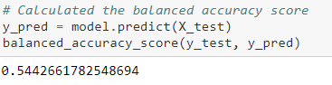
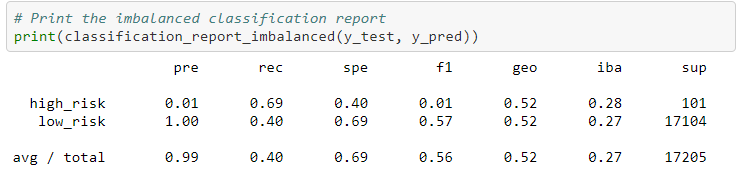
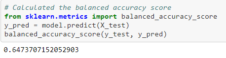
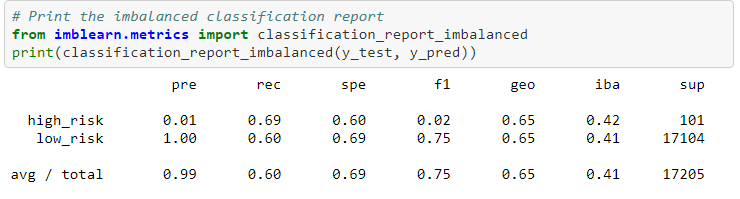
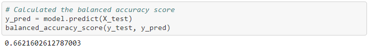
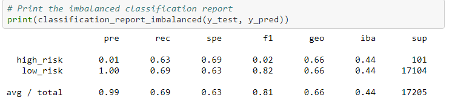

# Credit_Risk_Analysis

## Overview of Project
The purpose of this project is to apply machine learning to solve credit card risk. Using a given dataset from LendingClub, we will be oversampling the data using **RandomOverSampler** and **SMOTE** algorithms, undersampling the data using **ClusterCentroids** algorithm, a combined approach of oversampling and undersampling using **SMOTEEN** algorithm, and lastly compare **BalancedRandomForestClassifier** and **EasyEnsembleClassifier** machine learning models to reduce bias.

## Results
- Cluster Centroids Undersampling showed the worst results with a balanced accuracy score of 0.5443. This shows that is can only successfully predict credit risk correctly at only 54.43% of the time. This is nearly a 50/50 chance hence is only slightly better than a coin toss.

Looking at the Imbalanced Classification Report (ICR), on the f1 column, we see that the average/total is 0.56 and the F-score to be just 0.01. The results from the ICR are also too low to predict credit risk.

 
 - Naive Random Oversampling showed the second worst results with a balanced accuracy score of 0.6474. This shows that is can only successfully predict credit risk correctly at only 64.74% of the time. This is better than Cluster Centroids Undersampling as it can predict almost 2/3 of the credit risk yet is still not good enough to be used by creditors.

Looking at the Imbalanced Classification Report (ICR), on the f1 column, we see that the average/total is 0.75 and the F-score to be just 0.02.

- SMOTE Oversampling gave us the third worst results with a balanced accuracy score of 0.6622. This shows that is can only successfully predict credit risk correctly at only 66.22% of the time. This is slightly better than Naive Random Oversampling as it can predict 2/3 of the credit risk yet is still not good enough to be used by creditors.

Looking at the Imbalanced Classification Report (ICR), on the f1 column, we see that the average/total is 0.81 and the F-score to be just 0.02. Only simillar with Naive Random Oversampling for the average/total and F-score.

